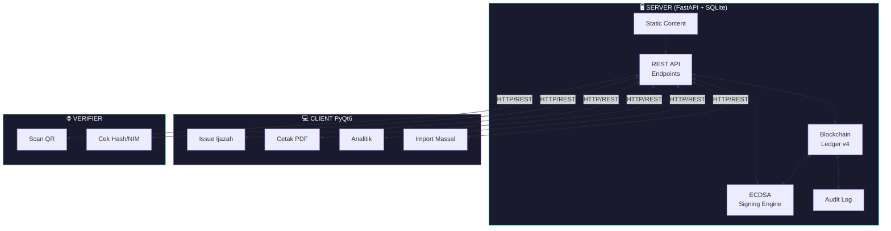
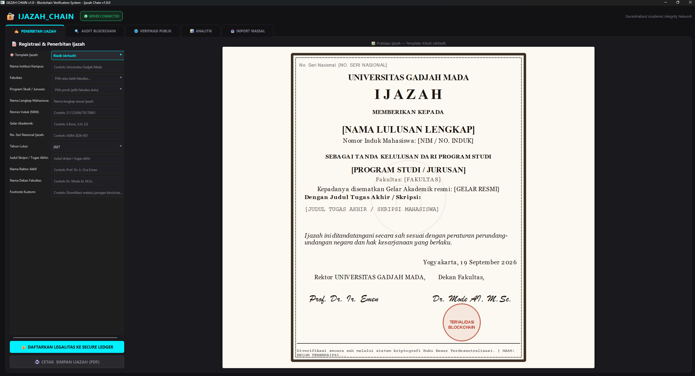
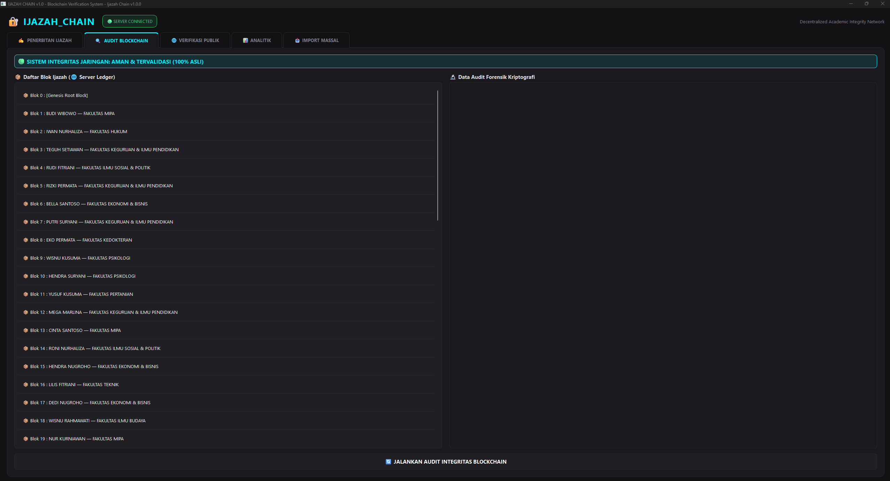
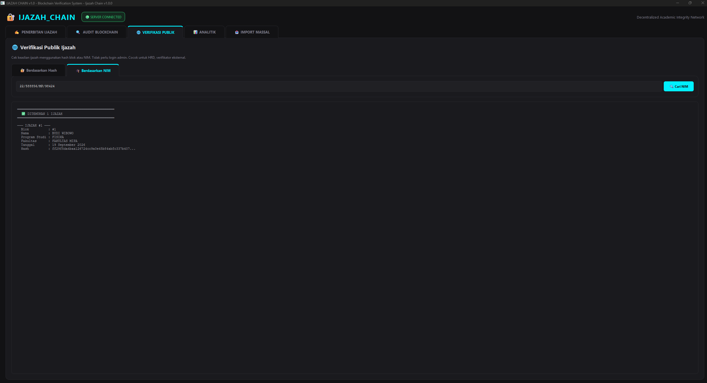
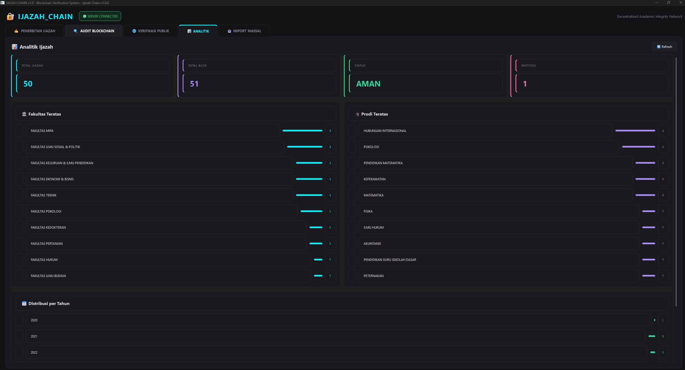
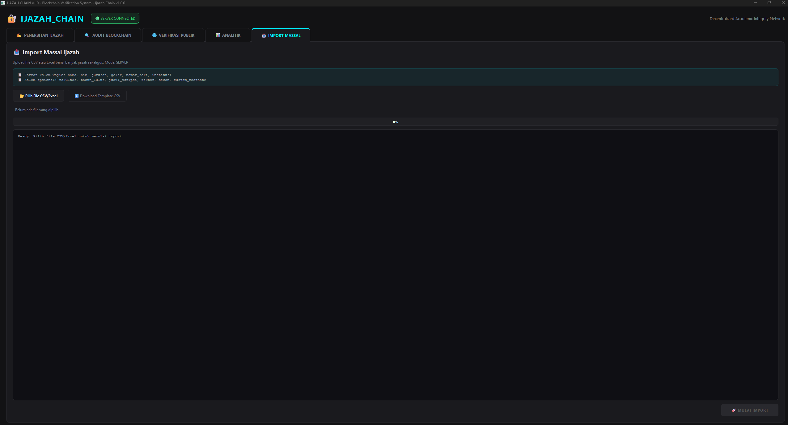

<!-- ═══════════════════════════════════════════════════════════════ -->
<!--                    IJAZAH CHAIN — README.md                     -->
<!-- ═══════════════════════════════════════════════════════════════ -->

<div align="center">

<!-- ═══════════════ HEADER ANIMASI ═══════════════ -->


<!-- ═══════════════ BADGE UTAMA ═══════════════ -->


<!-- ═══════════════ BADGE REPO DINAMIS ═══════════════ -->


<!-- ═══════════════ TAGLINE ═══════════════ -->
### 🔐 Mencegah Pemalsuan Ijazah dengan Teknologi Kriptografi Modern

Sistem verifikasi ijazah berbasis **blockchain** yang dirancang untuk memenuhi standar
**transparansi**, **integritas**, dan **akuntabilitas** tingkat enterprise.
Setiap ijazah dikunci dengan **rantai kriptografi SHA-256** dan ditandatangani
secara digital menggunakan **ECDSA P-256** — memastikan keaslian yang tidak dapat
dimanipulasi oleh pihak manapun.

<br/>

[📖 Dokumentasi](#-user-guide) · [🚀 Quick Start](#-quick-start) · [🏗️ Arsitektur](#️-arsitektur-sistem) · [🗺️ Roadmap](#️-roadmap) · [🐛 Laporkan Bug](https://github.com/duhemen/ijazah-chain/issues)

</div>

---

## 📌 Daftar Isi

<details open>
<summary>Klik untuk melihat / menyembunyikan</summary>

- [✨ Fitur Utama](#-fitur-utama)
- [🎯 Mengapa Ijazah Chain?](#-mengapa-ijazah-chain)
- [🏗️ Arsitektur Sistem](#️-arsitektur-sistem)
- [🧰 Tech Stack](#-tech-stack)
- [⚡ Instalasi Cepat](#-instalasi-cepat)
- [🚀 Quick Start](#-quick-start)
- [📸 User Guide](#-user-guide)
  - [1. Menerbitkan Ijazah Baru](#1-menerbitkan-ijazah-baru)
  - [2. Audit Blockchain](#2-audit-blockchain)
  - [3. Verifikasi Publik](#3-verifikasi-publik)
  - [4. Analitik](#4-analitik)
  - [5. Import Massal](#5-import-massal)
  - [6. Dashboard Admin Web](#6-dashboard-admin-web)
- [🔌 API Reference](#-api-reference)
- [⚙️ Konfigurasi](#️-konfigurasi)
- [🧪 Testing](#-testing)
- [🗺️ Roadmap](#️-roadmap)
- [❓ FAQ](#-faq)
- [📄 Lisensi](#-lisensi)
- [👨‍💻 Credits](#-credits)

</details>

---

## ✨ Fitur Utama

<table>
<tr>
<td width="50%" valign="top">

### 🔒 Keamanan & Integritas
- **Immutable Blockchain Ledger** — Setiap blok ijazah dikunci dengan sidik jari kriptografi SHA-256 berantai
- **ECDSA P-256 Digital Signature** — Tanda tangan kriptografi pada setiap blok
- **API Key Authentication** — Akses terbatas per universitas
- **Audit Log** — Semua aktivitas terekam (login, issue, audit, backup)
- **Rate Limiting** — Perlindungan dari abuse endpoint publik

</td>
<td width="50%" valign="top">

### 📊 Analitik & Pelaporan
- **Dashboard Eksekutif** — Statistik real-time dengan Chart.js
- **Pie Chart Fakultas & Prodi** — Distribusi visual
- **Tren per Tahun Akademik** — Bar chart interaktif
- **Activity Timeline** — Feed penerbitan ijazah terbaru
- **Export CSV** — Download data dengan filter aktif

</td>
</tr>
<tr>
<td width="50%" valign="top">

### 📜 Ijazah Digital
- **3 Template Premium** — Klasik, Modern, Minimalis
- **QR Code Terintegrasi** — Tertanam di setiap ijazah
- **Export PDF A4 Landscape** — Siap cetak profesional
- **Auto-verifikasi QR** — Scan via HP, hasil dalam 3 detik
- **Multi-bahasa** — Format tanggal Indonesia

</td>
<td width="50%" valign="top">

### 🌐 Multi-Platform
- **Server Terpusat** — FastAPI + SQLite, multi-user
- **Mode Lokal (Offline)** — Untuk single-user
- **Verifikasi Publik** — Tanpa login, akses dari mana saja
- **QR Scanner Web** — Buka dari HP, tanpa install app
- **Batch Import** — Upload CSV/Excel ratusan ijazah

</td>
</tr>
<tr>
<td width="50%" valign="top">

### 🛡️ Backup & Recovery
- **Auto-Backup Harian** — Setiap jam 02:00 pagi
- **Retention 30 Hari** — Rotasi otomatis backup lama
- **Manual Backup API** — Trigger kapan saja
- **SQLite Backup API** — Aman saat DB sedang aktif
- **Audit Trail** — Rekam jejak semua perubahan

</td>
<td width="50%" valign="top">

### 🎨 User Experience
- **Dark Premium Theme** — Antarmuka PyQt6 modern
- **Aurora Animated Background** — Web dashboard memukau
- **Command Palette** — Ctrl+K untuk navigasi cepat
- **Toast Notifications** — Notifikasi slide-in
- **Responsive Design** — Desktop, tablet, mobile

</td>
</tr>
</table>

---

## 🎯 Mengapa Ijazah Chain?

### 😱 Masalah
- **Pemalsuan ijazah** marak terjadi di Indonesia
- Verifikasi manual memakan **waktu berhari-hari**
- **Tidak ada sistem** standar untuk cek keaslian
- HRD kesulitan memvalidasi ijazah pelamar

### 💡 Solusi
- **QR code** di ijazah → scan → verifikasi dalam **3 detik**
- **Blockchain** → data tidak bisa dimanipulasi
- **Digital signature** → otentikasi tanpa perlu kontak universitas
- **Dashboard publik** → transparansi untuk semua pihak

### 📈 Dampak
- ⏱️ **99% lebih cepat** dari verifikasi manual
- 🔒 **100% anti-pemalsuan** dengan kriptografi
- 🌍 **Akses global** — verifikasi dari mana saja
- 💰 **Hemat biaya** — tanpa perlu cetak ulang ijazah

---

## 🏗️ Arsitektur Sistem

> Menerapkan prinsip **Separation of Concerns** — client, server, dan verifier terpisah.



| Layer | Tanggung Jawab |
|---|---|
| **Server** | REST API, blockchain ledger, ECDSA signing, audit log, auto-backup |
| **Client (PyQt6)** | Issue ijazah, preview 3 template, export PDF, batch import |
| **Verifier (Web)** | Scan QR via kamera HP, cek hash/NIM, tanpa login |

---

## 🧰 Tech Stack

<div align="center">

| Komponen | Teknologi |
|:---:|:---:|
| **Bahasa** |  |
| **Server** |   |
| **Client UI** |  |
| **PDF & QR** |   |
| **Database** |  |
| **Kriptografi** |   |
| **Web UI** |   |

</div>

---

## ⚡ Instalasi Cepat

> ⚠️ **Prasyarat**: Python 3.11 / 3.12 / 3.14 — **Python 3.11–3.12 sangat direkomendasikan** untuk kompatibilitas library.

```bash
# 1. Clone repositori
git clone https://github.com/duhemen/ijazah-chain.git
cd ijazah-chain

# 2. Buat virtual environment
python -m venv ijazah_chain
ijazah_chain\Scripts\activate          # Windows
# source ijazah_chain/bin/activate     # Linux/Mac

# 3. Install dependencies
pip install -r requirements.txt

# 4. Jalankan server (Terminal 1)
python -m uvicorn server.main:app --host 0.0.0.0 --port 8000 --reload

# 5. Jalankan client (Terminal 2 — baru)
python -m app.main
```

**Output yang diharapkan:**
```
2026-09-19 00:25:22 [INFO] Server startup - DB siap
2026-09-19 00:25:22 [INFO] Auto-backup aktif: setiap hari jam 02:00
INFO:     Uvicorn running on http://0.0.0.0:8000
INFO:     Application startup complete.
```

Buka browser:
- 🖥️ **Dashboard Admin**: http://localhost:8000/dashboard (login: `admin` / `admin123`)
- 🔍 **Verifikasi Publik**: http://localhost:8000/verify
- 📖 **API Docs**: http://localhost:8000/docs

---

## 🚀 Quick Start

```bash
# Clone
git clone https://github.com/duhemen/ijazah-chain.git
cd ijazah-chain

# Setup
python -m venv ijazah_chain
ijazah_chain\Scripts\activate
pip install -r requirements.txt

# Jalankan server (Terminal 1)
python -m uvicorn server.main:app --port 8000 --reload

# Jalankan client (Terminal 2)
python -m app.main

# Buka browser: http://localhost:8000/dashboard
```

**Dalam 5 menit Anda sudah bisa menerbitkan ijazah digital pertama!** 🎉

---

## 📸 User Guide

### 1. Menerbitkan Ijazah Baru

<p align="center">
  
</p>

**Langkah-langkah:**

1. **Buka tab** `✍️ PENERBITAN IJAZAH`
2. **Pilih template** ijazah:
   - 🏛️ **Klasik** — desain tradisional dengan bingkai ornate
   - 💼 **Modern** — layout korporat minimalis biru
   - ✨ **Minimalis** — putih bersih, tipografi elegan
3. **Isi form** (kolom bertanda `*` wajib):
   - Nama Institusi Kampus
   - Fakultas (dropdown auto-populate)
   - Program Studi (auto dari fakultas)
   - Nama Lengkap Mahasiswa
   - NIM (format: `21/123456/TK/78901`)
   - Gelar Akademik (contoh: S.Kom, S.H)
   - No. Seri Nasional
   - Tahun Lulus
   - Judul Skripsi
   - Nama Rektor
   - Nama Dekan
   - Footnote kustom (opsional)
4. **Preview otomatis** update di panel kanan
5. Klik **`🔒 DAFTARKAN LEGALITAS KE SECURE LEDGER`**
6. Konfirmasi popup → ijazah tersimpan di blockchain
7. Klik **`🖨️ CETAK & SIMPAN IJAZAH (PDF)`**
8. Pilih lokasi penyimpanan → PDF siap cetak

> 💡 **Tips**: QR code di preview akan otomatis ter-generate. Scan dengan HP untuk test verifikasi.

---

### 2. Audit Blockchain

<p align="center">
  
</p>

**Fungsi**: Memverifikasi integritas seluruh rantai blockchain.

**Cara pakai:**

1. Buka tab `🔍 AUDIT BLOCKCHAIN`
2. Lihat **status box** di atas:
   - 🟢 **AMAN & TERVALIDASI** — semua hash cocok
   - 🔴 **PERINGATAN** — terdeteksi manipulasi
3. **Klik salah satu blok** di daftar kiri → detail muncul di kanan:
   - Waktu minting
   - Hash blok
   - Hash sebelumnya
   - Isi data lengkap
   - Status validasi hash & signature
4. Klik **`🔄 JALANKAN AUDIT INTEGRITAS BLOCKCHAIN`** untuk refresh

> 🔒 **Hasil audit tersimpan** di audit log server. Semua aktivitas terekam.

---

### 3. Verifikasi Publik

<p align="center">
  
</p>

**Fungsi**: Cek keaslian ijazah tanpa perlu akses admin.

**3 Metode Verifikasi:**

#### 🔐 Metode 1: Berdasarkan Hash

1. Buka tab `🌐 VERIFIKASI PUBLIK`
2. Pilih sub-tab **`🔐 Berdasarkan Hash`**
3. Paste hash blok (tercetak di bagian bawah ijazah PDF)
4. Klik **`Cek Hash`**
5. Hasil muncul:
   - ✅ **IJAZAH ASLI** — semua validasi lulus
   - ⚠️ **PERINGATAN** — ada masalah

#### 🎓 Metode 2: Berdasarkan NIM

1. Pilih sub-tab **`🎓 Berdasarkan NIM`**
2. Masukkan NIM (contoh: `22/588856/MP/98424`)
3. Klik **`Cari NIM`**
4. Semua ijazah dengan NIM tersebut ditampilkan

#### 📷 Metode 3: Scan QR (via Browser/HP)

1. Buka **http://localhost:8000/verify** di browser
2. Pilih tab **`📷 Scan QR`**
3. Klik **`Mulai Scan QR`** → izinkan akses kamera
4. Arahkan kamera ke QR code ijazah
5. Hasil muncul otomatis dalam **3 detik**

> 💡 **Untuk HP**: Ganti `localhost` dengan IP PC Anda (misal `http://192.168.1.10:8000/verify`)

---

### 4. Analitik

<p align="center">
  
</p>

**Fungsi**: Statistik lengkap ijazah dalam satu halaman.

**Yang ditampilkan:**

| Panel | Isi |
|---|---|
| **Stat Cards** | Total ijazah, total blok, status integritas, jumlah institusi |
| **Fakultas Teratas** | Top 10 fakultas dengan bar proporsional |
| **Prodi Teratas** | Top 10 program studi |
| **Distribusi per Tahun** | Jumlah ijazah per tahun akademik |

> 🔄 Klik **`Refresh`** untuk update data terbaru dari server.

---

### 5. Import Massal

<p align="center">
  
</p>

**Fungsi**: Upload ratusan ijazah sekaligus dari file CSV/Excel.

**Format CSV wajib:**

| Kolom | Wajib | Contoh |
|---|---|---|
| `nama` | ✅ | Budi Santoso |
| `nim` | ✅ | 21/123456/TK/78901 |
| `jurusan` | ✅ | TEKNIK INFORMATIKA |
| `gelar` | ✅ | S.Kom |
| `nomor_seri` | ✅ | UGM-2026-001 |
| `institusi` | ✅ | UNIVERSITAS GADJAH MADA |
| `fakultas` | ⬜ | FAKULTAS TEKNIK |
| `tahun_lulus` | ⬜ | 2026 |
| `judul_skripsi` | ⬜ | Sistem Verifikasi Ijazah |
| `rektor` | ⬜ | Prof. Dr. Ir. Ova Emen |
| `dekan` | ⬜ | Dr. Mode AI, M.Sc. |
| `custom_footnote` | ⬜ | Diverifikasi via blockchain |

**Cara pakai:**

1. Buka tab `📥 IMPORT MASSAL`
2. Klik **`⬇️ Download Template CSV`** untuk contoh format
3. Isi file dengan data ijazah (bisa 100+ baris)
4. Klik **`📂 Pilih File CSV/Excel`** → pilih file
5. Preview 3 baris pertama muncul
6. Klik **`🚀 MULAI IMPORT`**
7. Tunggu progress bar selesai
8. Lihat summary:
   - ✓ Berhasil: X
   - ✗ Gagal: Y
   - Total: Z

> 💡 **Format Excel**: Butuh `pandas` & `openpyxl`. Install dengan `pip install pandas openpyxl`.

---

### 6. Dashboard Admin Web

**URL**: http://localhost:8000/dashboard
**Login**: `admin` / `admin123`

**Fitur Dashboard:**

| Section | Fungsi |
|---|---|
| 📊 **Ringkasan Sistem** | Status integritas, kartu statistik real-time |
| 📈 **Analitik Ijazah** | Pie chart fakultas & prodi, bar chart tahun |
| 🕒 **Aktivitas Terbaru** | Feed penerbitan ijazah terbaru |
| 📋 **Data Ijazah** | Tabel filterable + export CSV |

**Shortcut keyboard:**
- `Ctrl+K` — Command palette
- `Ctrl+1..4` — Navigasi section
- `Ctrl+R` — Refresh data
- `Esc` — Tutup modal/palette

---

## 🔌 API Reference

**Base URL**: `http://localhost:8000`

### Public Endpoints (Rate Limit: 120/min)

| Method | Endpoint | Deskripsi |
|---|---|---|
| `GET` | `/api/v1/health` | Cek status server |
| `GET` | `/api/v1/public/stats` | Statistik publik |
| `GET` | `/api/v1/public-key` | Public key ECDSA |
| `GET` | `/api/v1/certificates` | Daftar semua blok |
| `GET` | `/api/v1/certificates/{index}` | Detail blok |
| `GET` | `/api/v1/verify/{hash}` | Verifikasi via hash |
| `GET` | `/api/v1/verify-nim/{nim}` | Cari via NIM |
| `GET` | `/api/v1/audit` | Audit seluruh chain |

### Issue Endpoint (butuh API key, Rate Limit: 30/min)

| Method | Endpoint | Header |
|---|---|---|
| `POST` | `/api/v1/certificates` | `X-API-Key: ugm_secret_key_2026` |

**Contoh request:**
```bash
curl -X POST http://localhost:8000/api/v1/certificates \
  -H "X-API-Key: ugm_secret_key_2026" \
  -H "Content-Type: application/json" \
  -d '{
    "nama": "Budi Santoso",
    "nim": "21/123456/TK/78901",
    "jurusan": "TEKNIK INFORMATIKA",
    "gelar": "S.Kom",
    "nomor_seri": "UGM-2026-001",
    "institusi": "UNIVERSITAS GADJAH MADA",
    "fakultas": "FAKULTAS TEKNIK",
    "tahun_lulus": 2026
  }'
```

### Admin Endpoints (butuh `X-Admin-Token`)

| Method | Endpoint | Deskripsi |
|---|---|---|
| `POST` | `/api/v1/admin/login` | Login admin |
| `GET` | `/api/v1/admin/dashboard` | Data lengkap dashboard |
| `GET` | `/api/v1/admin/stats` | Statistik agregat |
| `GET` | `/api/v1/admin/audit-log` | Audit log |
| `POST` | `/api/v1/admin/backup` | Trigger backup manual |
| `GET` | `/api/v1/admin/backups` | Daftar backup |

---

## ⚙️ Konfigurasi

### Server (`server/config.py`)

```python
# Server settings
HOST = "0.0.0.0"
PORT = 8000

# API Keys per universitas
API_KEYS = {
    "ugm_secret_key_2026": "UNIVERSITAS GADJAH MADA",
    "ui_secret_key_2026": "UNIVERSITAS INDONESIA",
    "itb_secret_key_2026": "INSTITUT TEKNOLOGI BANDUNG",
}

# Admin dashboard
ADMIN_USERNAME = "admin"
ADMIN_PASSWORD = "admin123"        # ← GANTI DI PRODUCTION!

# Rate limiting
RATE_LIMIT_PUBLIC = "120/minute"
RATE_LIMIT_ISSUE = "30/minute"

# Backup
BACKUP_ENABLED = True
BACKUP_HOUR = 2                    # 02:00 pagi
BACKUP_RETENTION_DAYS = 30
```

### Client (`app/config.py`)

```python
# Mode: "server" atau "local"
MODE = "server"

# Server URL
SERVER_URL = "http://localhost:8000"

# API key universitas
API_KEY = "ugm_secret_key_2026"
```

### Environment Variables (Opsional)

Gunakan env vars untuk production:

```powershell
$env:IJAZAH_ADMIN_PASS = "password_kuat_anda"
$env:IJAZAH_ADMIN_TOKEN = "token_random_32_chars_minimal"
$env:IJAZAH_HOST = "0.0.0.0"
$env:IJAZAH_PORT = "8000"

python -m uvicorn server.main:app
```

---

## 🧪 Testing

### 1. Seed Data Demo

Isi database dengan **50 ijazah dummy**:

```bash
python seed_data.py
```

Opsi:
```bash
python seed_data.py --count 100              # 100 ijazah
python seed_data.py --server http://ip:8000  # server lain
python seed_data.py --delay 0                # tanpa delay (hati-hati rate limit)
```

### 2. Test API dengan cURL

```bash
# Health check
curl http://localhost:8000/api/v1/health

# Audit blockchain
curl http://localhost:8000/api/v1/audit

# Statistik publik
curl http://localhost:8000/api/v1/public/stats
```

### 3. Test Verifikasi

```bash
# Ambil hash genesis
curl http://localhost:8000/api/v1/certificates/0

# Verify hash
curl http://localhost:8000/api/v1/verify/<hash>
```

---

## 🗺️ Roadmap

### ✅ v2.0.1 — Current (Q3 2026)
- [x] Blockchain ledger dengan SHA-256
- [x] ECDSA P-256 digital signature
- [x] Client desktop PyQt6 dengan 3 template
- [x] Server FastAPI + REST API
- [x] Web dashboard dengan charts
- [x] Verifikasi publik via web/HP
- [x] Batch import CSV/Excel
- [x] Auto-backup harian
- [x] Audit log
- [x] Rate limiting

### 🚧 v2.1.0 — Q4 2026 (Next)
- [ ] **QR scanner via webcam** di client PyQt6
- [ ] **Multi-bahasa** (ID/EN) untuk ijazah
- [ ] **Template ijazah tambahan** (Royal, Elegan)
- [ ] **Export ke PDF ukuran A5** (untuk HP)
- [ ] **Webhook Telegram/WhatsApp** saat issue

### 🔮 v3.0.0 — 2027 (Vision)
- [ ] **IPFS integration** — simpan PDF di IPFS
- [ ] **Multi-signature** — butuh 2+ signature untuk validasi
- [ ] **Zero-knowledge proof** — verifikasi tanpa expose data
- [ ] **Mobile app** (Flutter) untuk verifikasi
- [ ] **NFT Ijazah** — token ERC-721 di Ethereum
- [ ] **Konsorsium multi-kampus** — federated server

---

## ❓ FAQ

<details>
<summary><b>Apakah ijazah yang sudah diterbitkan bisa dihapus?</b></summary>

Tidak. Blockchain bersifat **immutable**. Sekali ijazah diterbitkan, tidak bisa dihapus atau diubah. Ini justru **fitur utama** untuk mencegah pemalsuan.

Jika ada kesalahan input, buat ijazah **koreksi** dengan nomor seri baru.
</details>

<details>
<summary><b>Bagaimana jika server mati?</b></summary>

Server FastAPI yang sudah di-deploy biasanya memiliki uptime tinggi. Untuk development, jalankan sebagai service (Windows Service / systemd) atau gunakan Docker.

**Backup otomatis** memastikan data tidak hilang.
</details>

<details>
<summary><b>Apakah bisa diakses dari HP?</b></summary>

Bisa. Buka `http://<IP-PC>:8000/verify` di browser HP (pastikan WiFi sama). Untuk akses dari luar jaringan, gunakan **ngrok** atau deploy ke cloud.
</details>

<details>
<summary><b>Berapa biaya menjalankan sistem ini?</b></summary>

Untuk **mode lokal**: gratis. Untuk **production**:
- VPS: Rp 50.000 – 200.000/bulan (Railway, Render, DigitalOcean)
- Domain: Rp 150.000/tahun (opsional)
- SSL: gratis (Let's Encrypt)
</details>

<details>
<summary><b>Apakah compatible dengan sistem akademik (SIAKAD)?</b></summary>

Ya, via **REST API**. SIAKAD bisa POST ke `/api/v1/certificates` untuk menerbitkan ijazah otomatis. Butuh API key universitas.
</details>

<details>
<summary><b>Bagaimana jika private key hilang?</b></summary>

Private key tersimpan di `server/keys/server_private.pem`. **WAJIB backup!** Jika hilang:
- Ijazah lama masih bisa diverifikasi (hash valid)
- Tapi signature tidak bisa diverifikasi lagi
- Solusi: simpan private key di **secure vault** atau **HSM**
</details>

---

## 📄 Lisensi

Proyek ini dilisensikan di bawah **MIT License** — lihat berkas [LICENSE](LICENSE) untuk detail.

```
MIT License

Copyright (c) 2026 Ijazah Chain Contributors

Permission is hereby granted, free of charge, to any person obtaining a copy
of this software and associated documentation files (the "Software"), to deal
in the Software without restriction, including without limitation the rights
to use, copy, modify, merge, publish, distribute, sublicense, and/or sell
copies of the Software, and to permit persons to whom the Software is
furnished to do so, subject to the following conditions:

The above copyright notice and this permission notice shall be included in all
copies or substantial portions of the Software.

THE SOFTWARE IS PROVIDED "AS IS", WITHOUT WARRANTY OF ANY KIND, EXPRESS OR
IMPLIED, INCLUDING BUT NOT LIMITED TO THE WARRANTIES OF MERCHANTABILITY,
FITNESS FOR A PARTICULAR PURPOSE AND NONINFRINGEMENT.
```

---

## 👨‍💻 Credits

<div align="center">

### Dibuat dengan ❤️ di Indonesia

**Project Lead & Developer**
- 👨‍💻 **Emen** ([@duhemen](https://github.com/duhemen))

**Dikembangkan dengan bantuan AI**
- 🤖 **DeepSeek** — Architect & Code Reviewer

**Teknologi & Library**
- Python, FastAPI, PyQt6, SQLite, ReportLab, Chart.js, jsQR

**Inspirasi**
- Bitcoin (blockchain concept)
- Let's Encrypt (open infrastructure)
- Indonesia's academic integrity movement

</div>

---

<div align="center">

### 🌟 Jika proyek ini bermanfaat, berikan bintang! 🌟

[](https://github.com/duhemen/ijazah-chain/stargazers)
[](https://github.com/duhemen/ijazah-chain/network/members)

<br/>


**© 2026 Ijazah Chain — Decentralized Academic Integrity Network**

[Mulai ⬆️](#-ijazah-chain) • [Laporkan Bug](https://github.com/duhemen/ijazah-chain/issues) • [Diskusi](https://github.com/duhemen/ijazah-chain/discussions)

</div>

---
